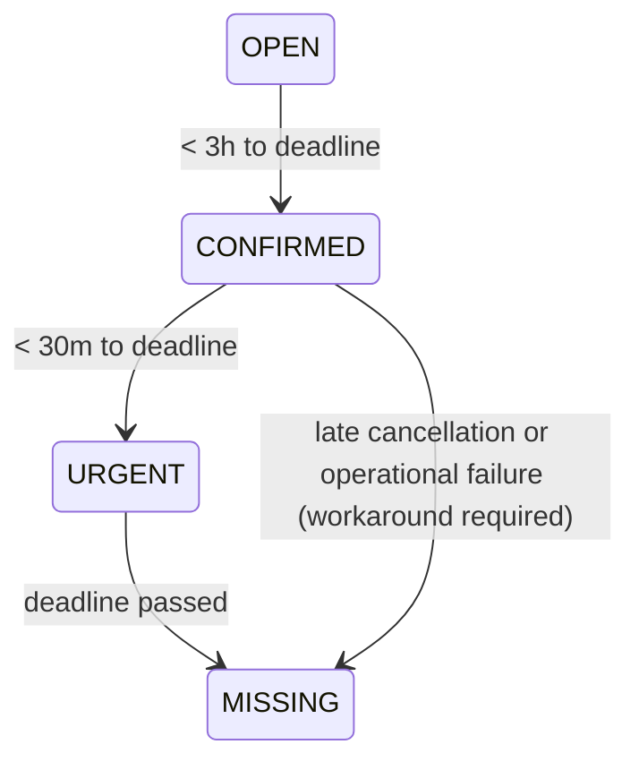

## MINI-PROJECT 1: TIME-AWARE PICKING WINDOW PLANNING

### Real-World Problem:

In picking operations with overlapping time windows,
the system tends to optimize local throughput instead of real temporal urgency. As a consequence:

- Critical windows are delivered late even when "nobody did anything wrong".
- Operations teams reprioritize manually outside the system.
- The system loses credibility as a source of truth.
- Some windows fall into batch without being picked and require manual workarounds.

The original model did not explicitly represent temporal urgency nor the operational failures derived from
time constraints.

### What this model change introduces:

This mini-project introduces explicit time semantics into the domain through operational window states:
- OPEN: >= 3 hours to deadline. Still open to new orders, not planned yet.
- CONFIRMED: < 3 hours and >= 30 minutes. Already committed to the picking flow, can be planned and can be mixed.
Still may accept new orders if capacity allows.
- URGENT: < 30 minutes. Can be picked, but must not be mixed with any other window.
- MISSING: an operational state (not a time state). Represents a system failure:
    - The window passed its deadline without being picked.
    - Or it was impacted by a confirmed order cancellation and requires a manual/return flow.

Time is no longer just a date comparison; it becomes part of the domain state.

### Picking Window Lifecycle

### Capacity and Order Admission:

Each picking window has a dynamic production capacity:
- Capacity is not fixed and can change in real time due to staffing, incidents or operational constraints.
- Each window tracks how much workload is already assigned versus its current maximum capacity.

Being in CONFIRMED state does not mean the window is closed to new orders. It means:
- The window is already committed to the picking flow.
- New orders may still be assigned as long as free capacity exists.

Order assignment follows a simple planning rule:
- New workload is assigned to the window closest to URGENT that still:
  - Is not URGENT or MISSING, and
  - Has remaining free capacity.

This models a real production-planning constraint:
time alone is not enough; capacity limits must be respected to avoid overcommitment and downstream operational failures.

### Window mixing rules:

Picking windows are allowed to be mixed according to explicit rules:
 - If either window is URGENT → mixing is not allowed.
 - Only windows in CONFIRMED state can be mixed.
 - Mixing is only allowed if both windows share at least one product.

This reflects a real operational constraint:
mixing is acceptable only when there is real work overlap and no critical window is put at risk.

### Picking in Advance (Next-Day Windows):

The model also supports a controlled form of picking in advance for next-day windows.

Operational rule:
- As long as there is any unpicked workload for the current day, next-day windows must not be exposed for picking.
- Only when the current day is fully completed, the system may allow advancing to the next day.

This is controlled by a manual operational flag:
- When the current day si fully picked, and
- When the flag is explicitly enabled,
- Pickers may start working on next-day windows, even if those windows are not yet time-confirmed.

This prevents harmful mixing between "today" and "tomorrow" work, which in real operations leads to:
- Half-empty picking carts in batch.
- Inefficient routes.
- Resource contention.
- And lack of available work for the next shift on high-volume days.

In other words, the system enforces a strict horizon separation:
- Today first.
- Tomorrow only when today is fully completed and the operation explicitly allows it.

### Why the MISSING state exists:

MISSING does not represent "time". It represents and explicit operational failure:
- A window that reaches batch without being picked is not just "late":
it requires manual intervention (staging, reprocessing, etc.).
- A confirmed order cancellation implies a return or manual handling flow.

Instead of hiding these cases behind generic errors or exceptions,
the system models them as a domain state, making them visible, traceable and actionable.

### Trade-offs:

Costs:
- Lower local efficiency in some scenarios.
- More domain rules to maintain.

Benefits:
- More predictable SLA behavior.
- Less operational firefighting and fewer out-of-system workarounds.
- A more explainable and trustworthy system.
- Operational failures stop being implicit and become part of the model.

### Out of Scope:

This mini-project does not address:
- Bag capacity.
- Picking area limits.
- Batch/orchestration implementation.
- UI or presentation layers.

Its goal is to model time, capacity and planning horizon rules for picking windows,
not the execution or orchestration layers.

### Where this lives in the code:

This behavior is modeled mainly in:
- PickingWindowStatus.
- PickingWindow.
- Product.
- PickingHorizonPolicy.
